# Healthcare Data Automation & Dashboard System

## Overview
Built an automated data pipeline using Google Sheets to transform raw EHR reports into real-time dashboards.

## Dashboard Overview
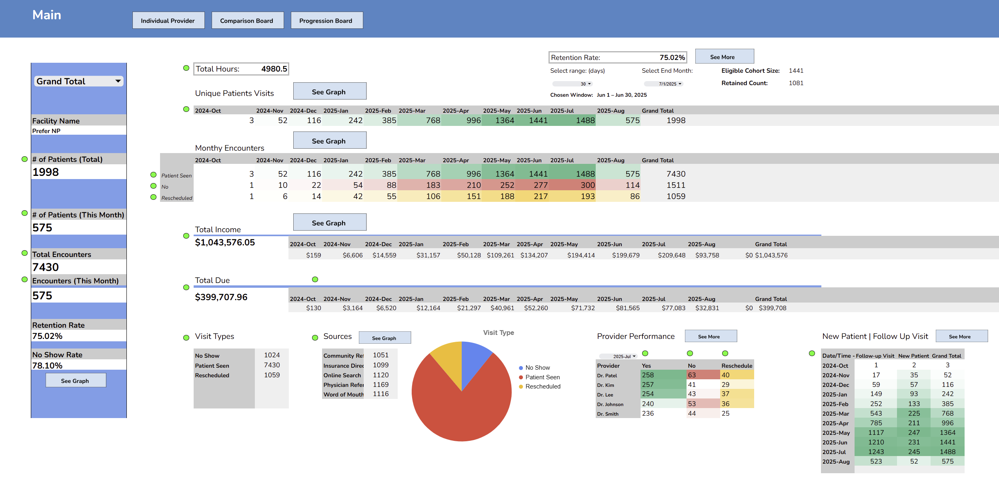
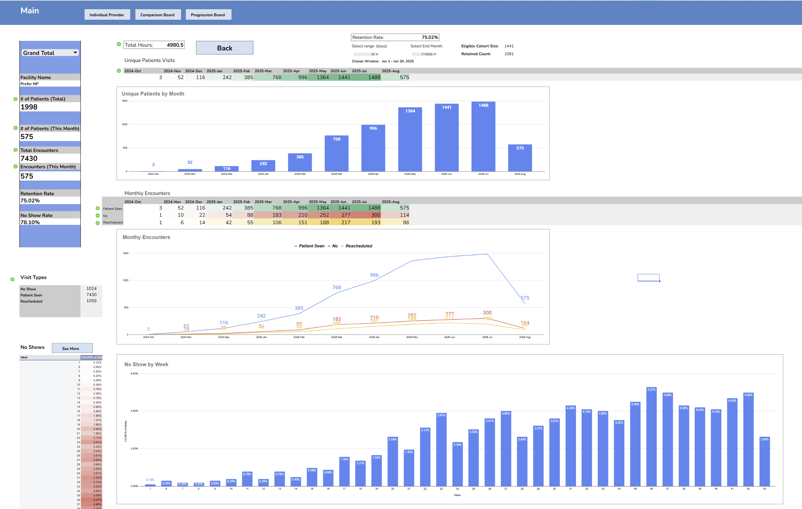
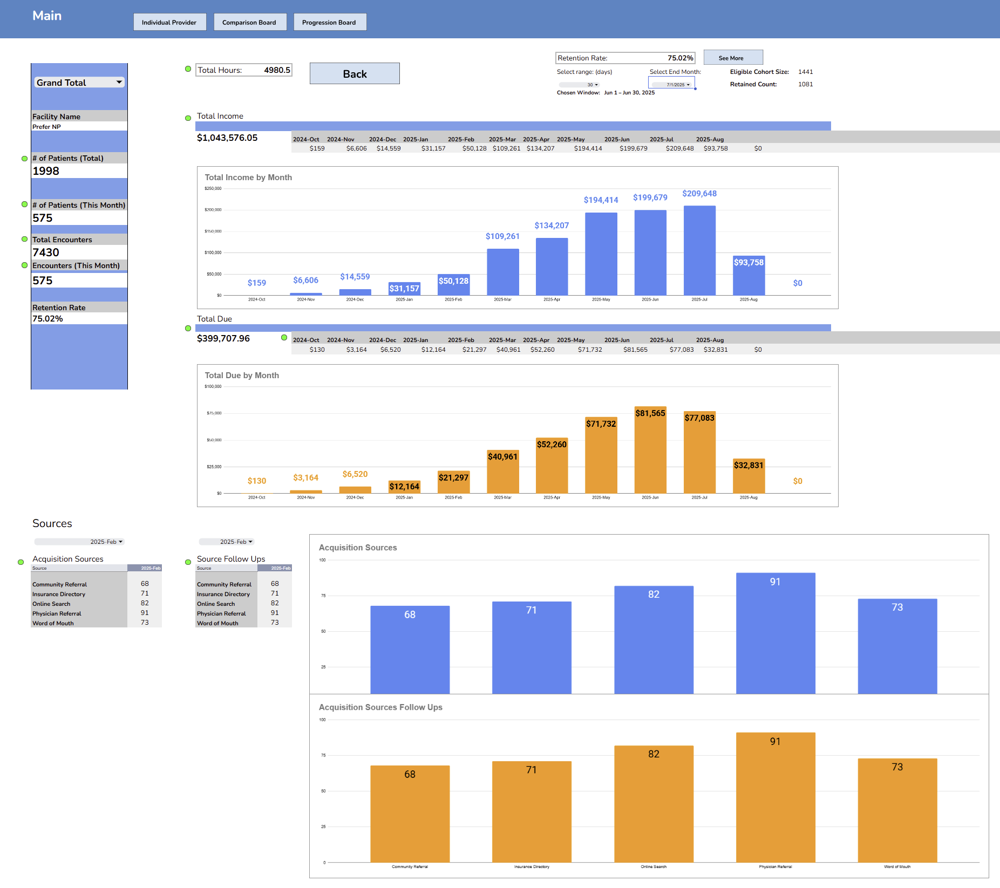
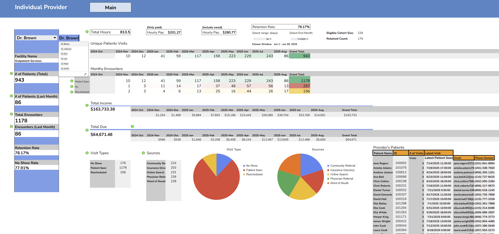
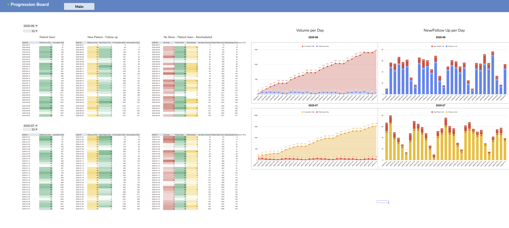
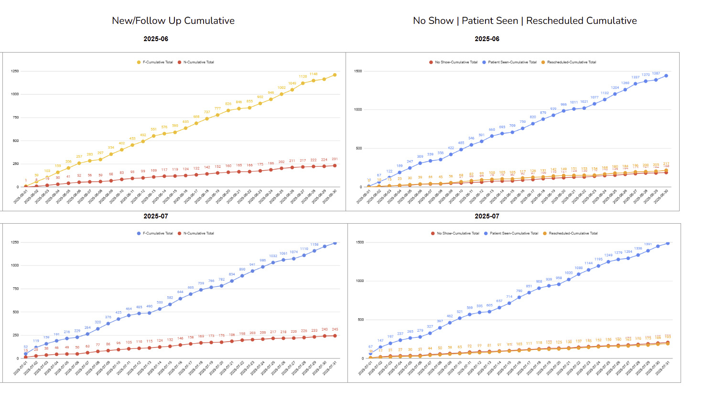
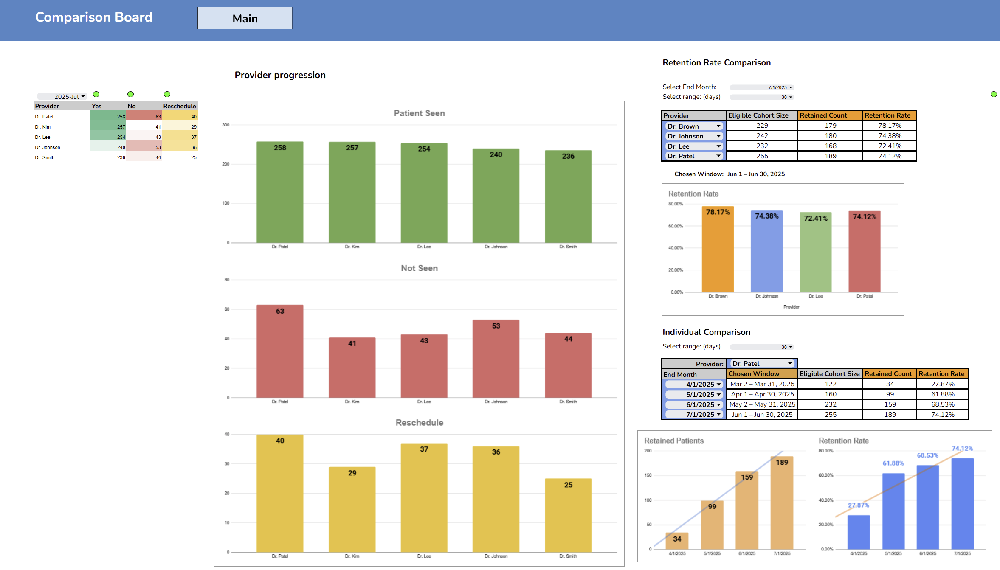
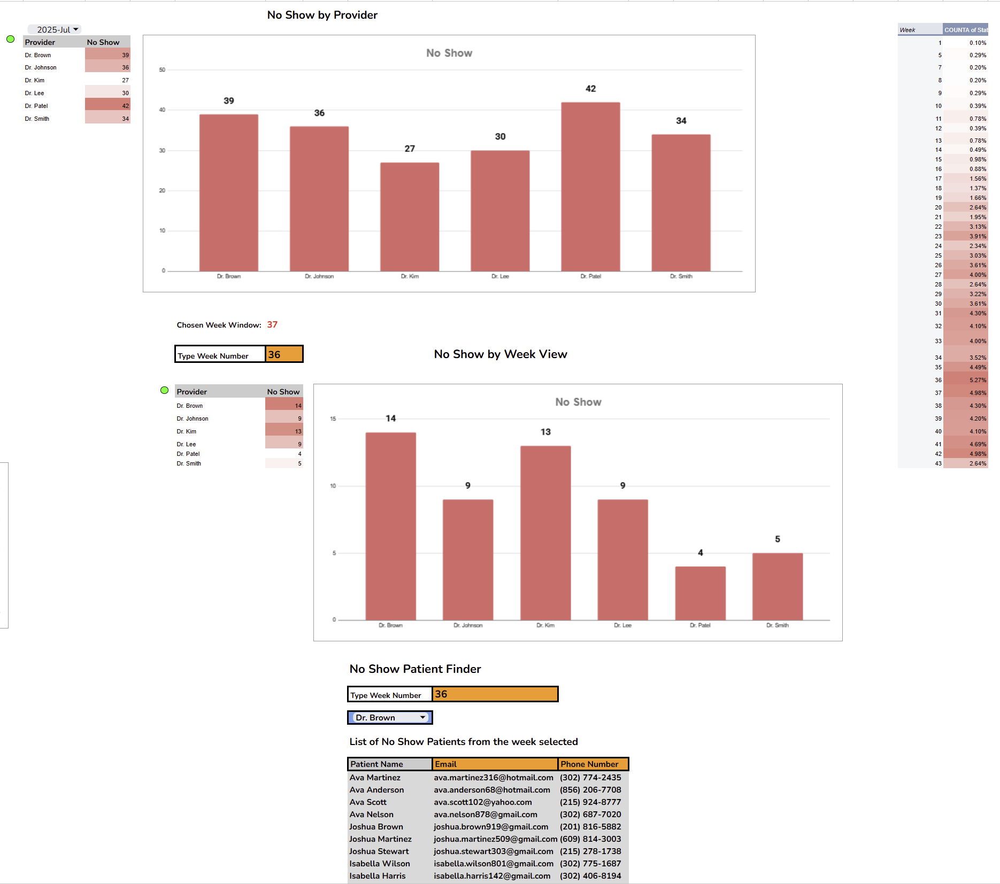

## Raw Data Input (EHR Export)
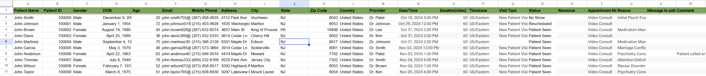
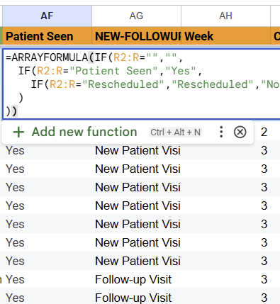
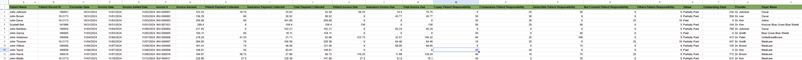
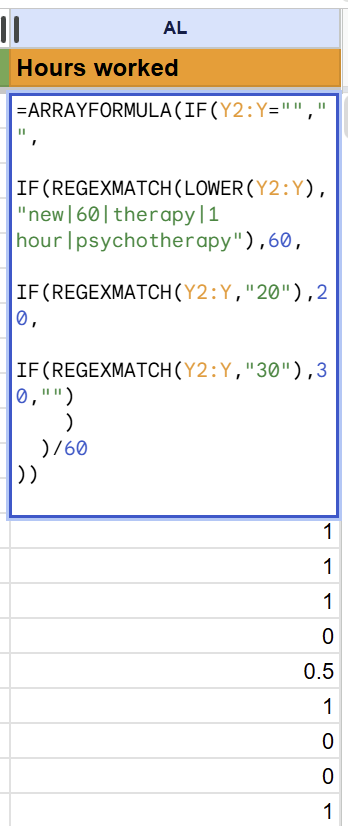

## Problem
Manual reporting from weekly EHR reports was time-consuming and inefficient.

## Solution
- Drop weekly reports into source sheets
- Data automatically updates using formulas and pivot tables
- Dashboards refresh in real-time

## Key Metrics
- Patient growth
- Retention
- Provider performance
- Revenue

## Tools Used
- Google Sheets
- Pivot Tables
- Advanced formulas (FILTER, QUERY, ARRAYFORMULA)

## Impact
- Eliminated manual reporting
- Enabled real-time insights
- Supported ~550% patient growth (324 → 2,093)
